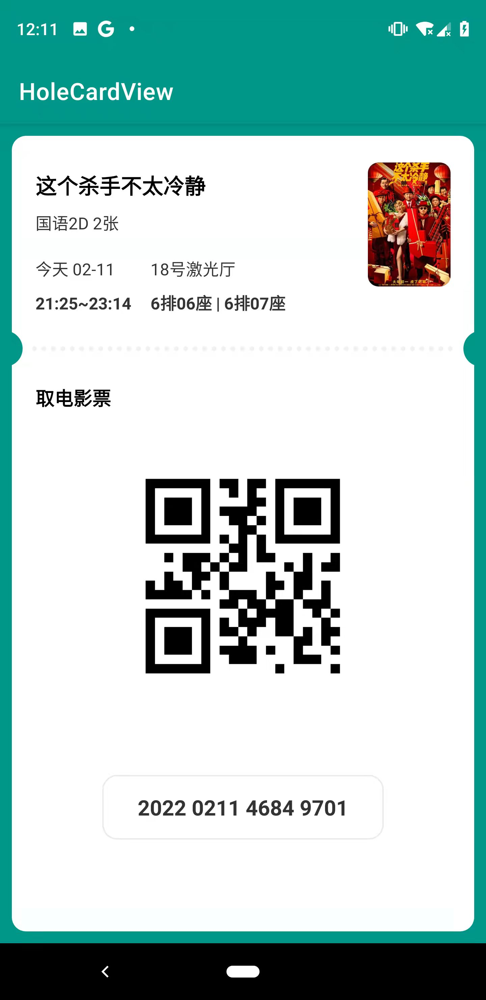
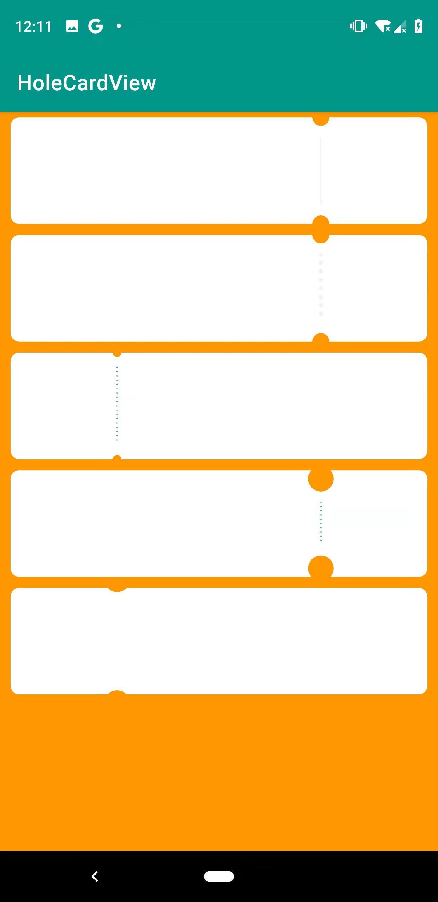
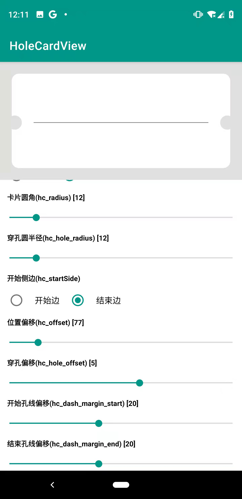
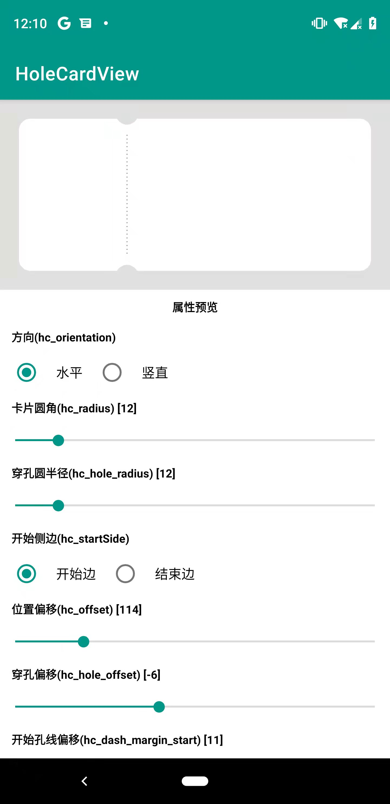

## HoleCardView

[](https://jitpack.io/#ctop007/holeCardview)&ensp;[](https://android-arsenal.com/api?level=21)&ensp;[](https://github.com/loperSeven)&ensp;[](https://opensource.org/licenses/MIT)


基于实际项目分离出来的一个库，方便实现一些穿孔效果的卡片视图

可以轻松实现 小票、电影票、机票、分享卡片、穿孔卡片 等等效果


## Preview

<div>


</div>
<div>


</div>


## Simple Demo


或者 [点击下载](https://github.com/ctop007/HoleCardView/raw/master/preview/app-debug-v1.0.0.apk)


## 引入

#### Step 1. 添加 JitPack Repository

```
allprojects {
	repositories {
		...
		maven { url "https://jitpack.io" }
	}
}
```
#### Step 2. 添加 Gradle依赖

```
dependencies {
    ...
    // HoleCardview https://github.com/ctop007/HoleCardView
    implementation 'com.github.ctop007:holeCardview:v1.0.0'
}


```


## 如何使用

```xml
<com.ctop007.holeCard.HoleCardView
        android:id="@+id/cardView"
        android:layout_width="match_parent"
        android:layout_height="match_parent"
        android:layout_margin="10dp"
        app:hc_color="@color/white"
        app:hc_dash_color="#F1F1F1"
        app:hc_dash_gap="8dp"
        app:hc_dash_margin_end="10dp"
        app:hc_dash_margin_start="10dp"
        app:hc_dash_radius="4dp"
        app:hc_dash_visible="true"
        app:hc_hole_offset="-6dp"
        app:hc_hole_radius="15dp"
        app:hc_offset="180dp"
        app:hc_orientation="vertical"
        app:hc_radius="12dp"
        app:hc_startSide="start"
        app:layout_constraintLeft_toLeftOf="parent"
        app:layout_constraintRight_toRightOf="parent"
        app:layout_constraintTop_toTopOf="parent" />
```


## 属性

| 属性                 | 注释                                                         |
| :------------------- | ------------------------------------------------------------ |
| hc_color             | 卡片背景颜色                                                 |
| hc_dash_color        | 虚线颜色                                                     |
| hc_dash_gap          | 虚线点间距                                                   |
| hc_dash_margin_end   | 虚线与第二个圆孔之间的距离                                   |
| hc_dash_margin_start | 虚线与第一个圆孔之间的距离                                   |
| hc_dash_radius       | 虚线圆的半径                                                 |
| hc_dash_visible      | 是否显示虚线                                                 |
| hc_hole_offset       | 圆孔偏移，正值向内偏移，负值向外偏移                         |
| hc_hole_radius       | 圆孔半径                                                     |
| hc_offset            | 挖孔的位置偏量，该值由 hc_startSide 属性决定从哪侧开始       |
| hc_orientation       | 表示上下/左右挖孔； 可选值[horizontal/vertical]              |
| hc_radius            | 卡片的圆角                                                   |
| hc_startSide         | 表示从哪侧开始计算 hc_hole_offset 的值；可选值 [start / end ] |


## 联系我
邮箱：ctop007@163.com


## Licenses
```
MIT License

Copyright (c) 2022 caopu

Permission is hereby granted, free of charge, to any person obtaining a copy
of this software and associated documentation files (the "Software"), to deal
in the Software without restriction, including without limitation the rights
to use, copy, modify, merge, publish, distribute, sublicense, and/or sell
copies of the Software, and to permit persons to whom the Software is
furnished to do so, subject to the following conditions:

The above copyright notice and this permission notice shall be included in all
copies or substantial portions of the Software.

THE SOFTWARE IS PROVIDED "AS IS", WITHOUT WARRANTY OF ANY KIND, EXPRESS OR
IMPLIED, INCLUDING BUT NOT LIMITED TO THE WARRANTIES OF MERCHANTABILITY,
FITNESS FOR A PARTICULAR PURPOSE AND NONINFRINGEMENT. IN NO EVENT SHALL THE
AUTHORS OR COPYRIGHT HOLDERS BE LIABLE FOR ANY CLAIM, DAMAGES OR OTHER
LIABILITY, WHETHER IN AN ACTION OF CONTRACT, TORT OR OTHERWISE, ARISING FROM,
OUT OF OR IN CONNECTION WITH THE SOFTWARE OR THE USE OR OTHER DEALINGS IN THE
SOFTWARE.
```
